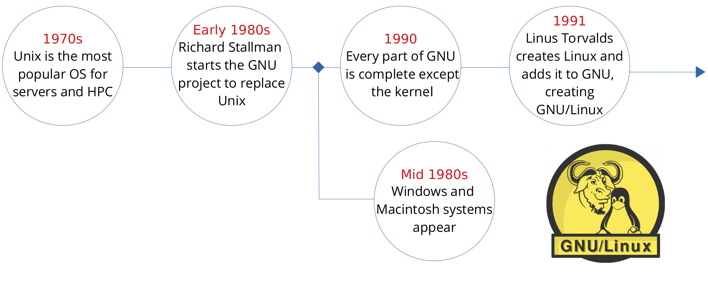
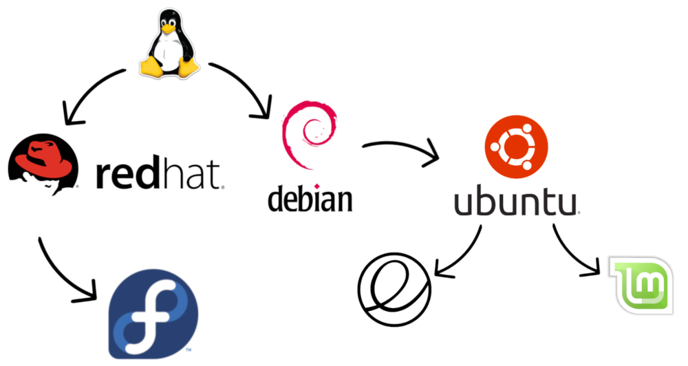

# Session 1

## What is an operating system?
An operating system (OS) is system software that manages computer hardware, software resources, and provides common services for computer programs.

**Examples:** Unix, Minix, Linux, macOS and Microsoft Windows.

## What is Linux?
Linux has been around since the mid-1990s and has since reached a user-base that spans the globe. Linux is actually everywhere: It's in your phones, your thermostats, in your cars, refrigerators, and televisions. It also runs most of the Internet, all of the world’s top 500 supercomputers, and the world’s stock exchanges.

Here's an example of a smartwatch running Linux:

**Fun fact:** Most laptops used by the astronauts in the International Space Station (ISS) run a Linux based operating systems (Debian).

**Note:** The *correct term* is GNU/Linux not just Linux or GNU, because it is the GNU operating system using the Linux kernel. 
We just say Linux because it is shorter, easier to say, and more popular.
### Where did it come from?

**Extras:** [History of Operating Systems | تاريخ أنظمة التشغيل](https://www.youtube.com/watch?v=fxXGLMPJnFQ)

### Linux Distribution Families
Since Linux and GNU are both open source, many people from different communities have made different Linux Distributions.
There are too many distributions to count, so we’ll talk about the three main families:

1. **Red Hat Family**

This family concentrated on the enterprise side of things, such as servers and company workstations.

2. **Debian Family**

The Debian family started with the home user in mind, the community wanted to make GNU/Linux available for the average user as much as it was for enterprises at the time.

3. **Other distributions built for specific use cases**

Distributions such as Arch Linux, openSUSE, SLES, Gentoo, and many others were made for specific use cases or optimisations based on what the community wanted.

**Extras:** [Here's a link to a more full and HUGE Linux family tree.](https://upload.wikimedia.org/wikipedia/commons/1/1b/Linux_Distribution_Timeline.svg)
## Why Linux?

There are many reasons to use Linux, I’ll name a few but there are always more reasons.

1. **Privacy and Security**

The operating system respects the privacy of users to a really unique extent, once the system starts running everything that happens is under your control unless a third party services is used.
That is mainly due to it being open source, so developers can’t hide spyware or force anything on the user, as they will be able to somehow avoid or change it.

2. **Required in Companies**

It is required in many companies, including Microsoft, ITWorx, Mentor, Valeo, and a lot of other big popular companies.

3. **Good Development Environment**

Due to features like package managers, the command line, the operating system being very low on resource usage, customisability, and many more, GNU/Linux is a great development environment.

4. **Free**

GNU/Linux is both free as in freedom and free of charge, it has a lot of great alternatives for proprietary sofrware that people use daily.

5. **Decentralised Development**

GNU/Linux isn’t owned by a single company, its development is community driven. People contribute to the Linux kernel and other assets of the GNU operating system.

6. **Customisability**

The operating system is very modular and customisable, which allows you to create your own customised system according to your needs.

7. **Much more!**

