# Session 2

# The Shell

## What is a Shell?
Look at the following diagram:

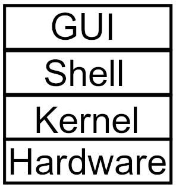

**The GUI:** Graphical User Interface, used to allow the user to interact with the system by using a graphical interface.

**The Shell:** Allows the user to use the OS by typing commands.

**The Kernel:** The core of the OS, responsible for memory management, and communication with the hardware.

The shell is the first user-friendly layer that a user can use to interact with the operating system.

**Examples:** sh, bash, zsh, csh and fish.

# Terminal vs Shell vs Prompt

### Terminal
In the early days of computing, terminals where physical devices connected to a central computer in Universities and Research facilities. 

Here's an sample "dumb" terminal. Internally it does not have a microprocessor, it's connected to a master computer.

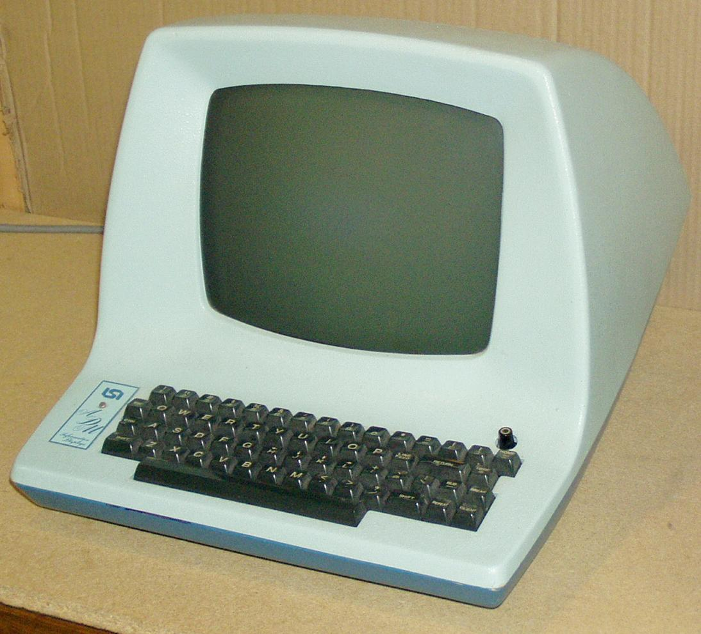

Nowadays, personal computers and laptops are cheap and accessible. The lead to the extinction of Terminals. Instead, the Terminal Emulators gave rose and replaced the functionalities of the old physical terminals. 

A terminal emulators is a program that emulates a real terminal connected to your machine. In other words, it provides you with the Shell.

In your Linux machine, search for "Terminal" and open it to view a terminal.

It should look something like this:

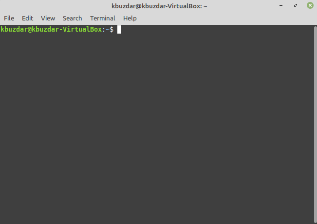


### Shell
We have already discussed what a shell is. Shells run inside terminal emulators which means that the terminal won't be useful without a shell running in it.
The terminal sample shown above is running the *bash* shell.

It looks something like this:

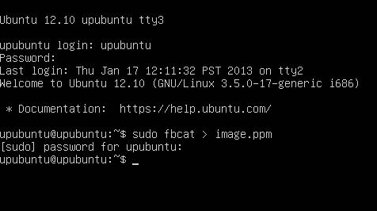

**Note:** you can run Bash without opening up a terminal emulator. More on that later.

### Prompt
When you open the terminal you’ll see something like this:

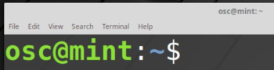 
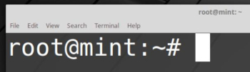

It is prompting you to enter a command, let’s break it down:

```osc/root``` : The username of the current logged in user.

```@```: Defines that you are connected to the machine that has the name after it

```mint```: The name of the computer running (Name of the host)

```~```: The working directory, the directory that the terminal is working in right now.

```$```: States that you are logged in as a regular user.

```#```: States that you are logged in as the system administrator (root).

So we can basically summarize it to the following:

```USERNAME@HOSTNAME:WORKING_DIRECTORY($/#)```


## The Command Line Syntax
When ordering the computer to do something, **i.e giving it a command**, you have to take care of the syntax.

Just like programming languages, the Linux shell has specific syntax that you have to use. Just so that it could be understood by the shell.

The syntax goes as follows:
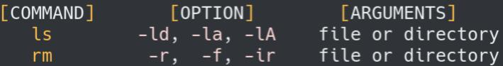

**The Command:** Intuitively, this is the command that you give to the system, i.e.
delete, move, copy, list, etc..

**The Option:** Modifies the action of the command.

**Example:** List “ALL” files, delete “recursively”, show the first “40” lines of a file, delete the file “by force”

**The Arguments:** What you’re going to apply the command to. i.e. Delete (command) a certain file (argument). We can say in short that the options modify the command’s effect on the argument.

#### Let’s take the ls command as an example:
```ls``` – lists the content of a directory(folder).

Running the command ls does the following:


But that format isn’t really good if you want a detailed view, so we add the ```-l``` option which makes it list the content but in a “long” form:

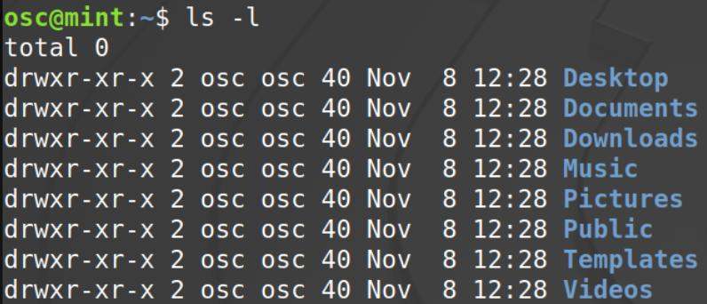

Much better! Everything is cleaner and organized in a list.

How about we take a look at the hidden files too?

The ```-a``` option lists “all files”, this command can be shortened down to ```ls -la``` or ```ls -al```

**Note:** Hidden files and directories in Linux start their name with a dot”.”.
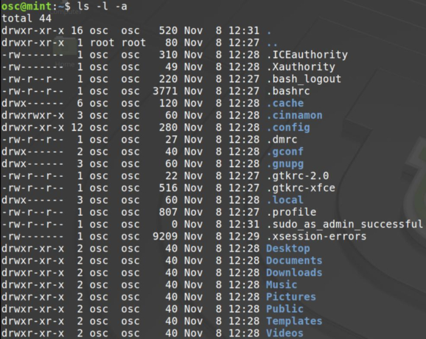

# Filesystems
## What is a filesystem?
A filesystem is the way that the files are stored on a storage device (i.e. Hard Drive, USB Flash Drive, etc..).

Each operating system uses a certain filesystem:
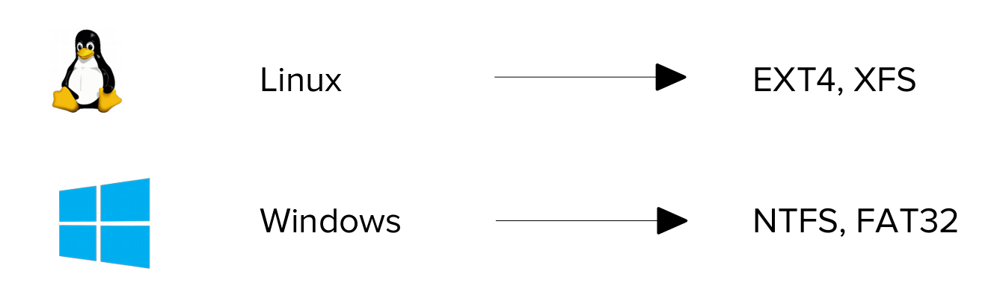

**Note:** Linux supports NTFS and FAT32, but Windows doesn’t support EXT4 or XFS, that’s why you can’t see the Linux partitions on Windows.

## Windows Directory Structure
A directory structure is the way an operating system's files are arranged displayed to the user.
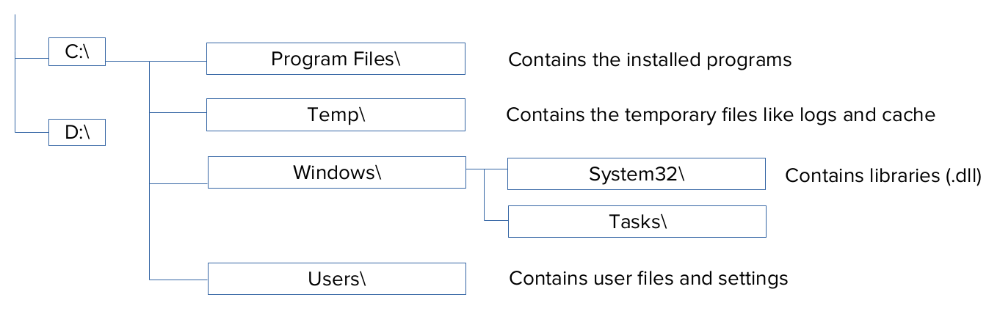

Windows, like every operating system, has a specific directory structure for its **NTFS** file system. Each disk is assigned a letter, and you browse your files based on that. 

**Note:** C:\ and D:\ could be 2 separate physical hard drives.


Linux also has a directory structure, called **“Filesystem Hierarchy Standard”** or **“The Linux Filesystem Hierarchy”**.


# Linux Filesystem Hierarchy
### The root ‘/’ directory
The ‘/’ directory or the “root” directory is where everything begins on Linux.

No matter what you want to access, where it is, it will somehow connect to the
root directory.

#### Here’s a demonstration of the Linux Filesystem Hierarchy:

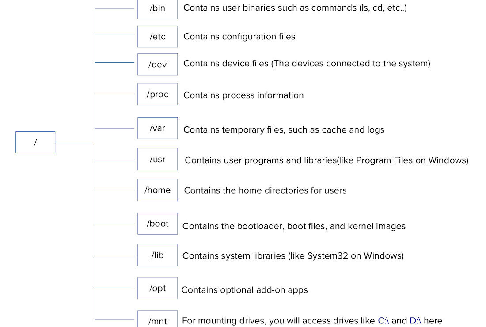

From the previous, we can see that: “Everything in Linux is a file”. 
Even devices and processes, everything is a file under the ‘/’ directory somehow.

**Note:** C:\ and D:\ here are not accessed as C:\ or D:\\, but instead as directories under ‘/’.

**Let’s test it out!**
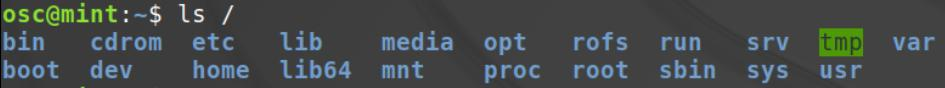
If we list the content of the root directory using the ```ls``` command, we will find the directories in the previous diagram.

Now we know what a filesystem, directory, and file are. Let’s talk about how we can access them.

## Navigating through the filesystem

You opened a terminal, now what?
The first thing you want to do is to know where the terminal is working:

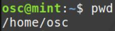

```pwd```: Print Working Directory, tells you the directory your terminal is working in.

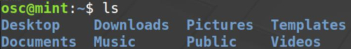

Now that you know where you are in the system, you should see the content of
the directory using the ```ls``` command.

What if we wanted to enter the Pictures directory?

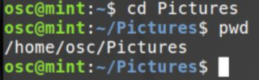

```cd```: Change Directory, changes the working directory to the specified argument.

Now the working directory is Pictures, notice how the text before **$** also changed to **~/Pictures** which is the same as **/home/osc/Pictures**, which is the working directory.

What if I wanted to go back to the home directory?
There are 4 ways:
* ```cd ~```: This basically means cd /home/osc since ~ means the home directory of the current user.
* ```cd /home/osc```: Tells the shell to change the working directory to /home/osc.
* ```cd```: Running the cd command without an argument takes you to the home directory by default.
* ```cd ..```: .. refers to the parent directory, continue reading:

### The ```.``` and ```..``` Links
Each directory has 2 hidden files (links) in it, ```.``` and ```..```.

The ```.``` link refers to the directory itself.

The ```..``` link refers to the directory before it (parent directory).

**Example:** If the working directory is /home/osc/Pictures/, then:

```‘.’ = /home/osc/Pictures/``` and ```‘..’ = /home/osc/``` which is the directory before it.

To verify:

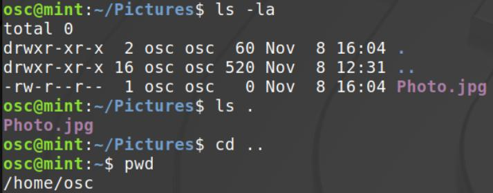

This can be a little confusing at first, so practice with yourself and maybe try drawing it on a piece of paper to visualize how things really work.

### Relative and absolute paths

Let’s simplify this by taking a guy called “Jack” as an example, Jack goes to FCIS ASU every day, this is the path he takes daily:
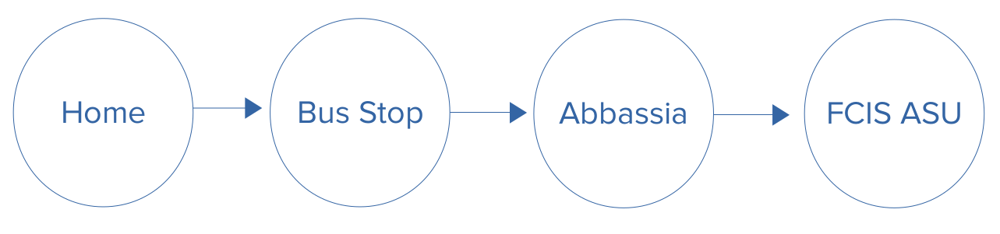

Jack’s route to college daily is **Home->Bus Stop->Abbassia->FCIS ASU.**

If he met someone at Abbassia and asked him: “Where are you going?”, Jack’s response will be **“FCIS ASU”** only, because that’s the next step.
If someone asked Jack “What’s your full route to college?”, Jack’s response would be **“ Home->Bus Stop->Abbassia->FCIS ASU”.**

**Note that his route from Abbassia is shorter because it is relative to Abbassia.**

The same thing applies in Linux for directories and files.

**Absolute Path:** The total path leading to the directory.

**Relative Path:** The path relative to the working directory.

**Example:**
In the diagram, let the working directory be /home/User1

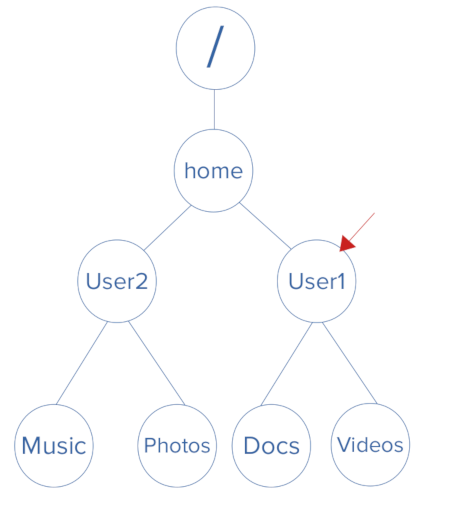

The relative path for “Videos” would be: Videos

The absolute path would be: /home/User1/Videos

##### Test yourself(Solution at the end):
In the same diagram, let the working directory be /home/User1 and the user you’re logged in as called User1.

* Which directory does ‘.’ refer to?
* Which directory does ‘..’ refer to?
* What would be the working directory if you run ```cd ..```?
* What would be the working directory if you run ```cd .```?
* What would be the working directory if you run ```cd``` Videos?
* What would happen if you run ```cd ../User2/```?
* What would happen if you run ```cd```?
* What would happen if you run ```cd User2```?
* What would happen if you run ```cd /home/User2```?

##### Solution:
* The directory itself (User1).
* The parent directory (the directory before it: home).
* The working directory would be home.
* The shell will change the directory to the current working directory so nothing will change.
* The shell will change the working directory to /home/User1/Videos.
* The shell will change the working directory to /home/User2 (This is the relative path)
* The shell will change the working directory to /home/User1 as you are logged in as User1, so nothing will change because the working directory is already /home/User1
* Error, there isn’t a directory called “User2” under the directory “User1”.
* The shell will change the working directory to /home/User2 (This is the absolute path)


# The Manual Pages, Links,  and Managing Directories and Files

## Man Pages 
### What are Man Pages ? ###
It stands for manual pages.

They’re a set of pages that explain what every command on the system does, what options are available, what arguments it can take, and shows you how to use them.

**To open a man page type:**`` man [COMMAND NAME]``

**Example:** ``man man``

This will show you the manual of the “man” command.
You can use the arrow keys to navigate the pages and you can hit **q** to quit or **h** for help.


If you want to search for a specific word you can press slash (/) then type it on the keyword and press enter.

**Example:** ``/sections`` will make you search for “sections”.


This indeed does bring up the first occurrence of the word ***"sections"***.


**Note:** You can also use ``info`` and ``--help`` to get information about a command.

**Example:** ```info ls```  and ```ls --help```

### Searching for a Command ###

If you need to do a specific task but don’t know which command can do it:

* You can use ``apropos`` or ``man -k`` to search for that command by the keyword of the command.

**Example:** ``man -k "rename"``

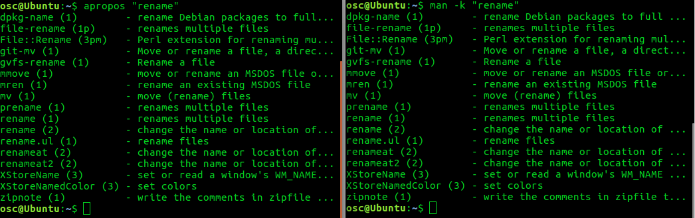

As you can see, all of these are commands that can rename something.
Which one you choose is up to you. You can use man pages to know more about these commands and select the suitable one for your case.

* You can use ``whatis`` or ``man -f`` to quickly see what a command does

**Example:** ``whatis mv``

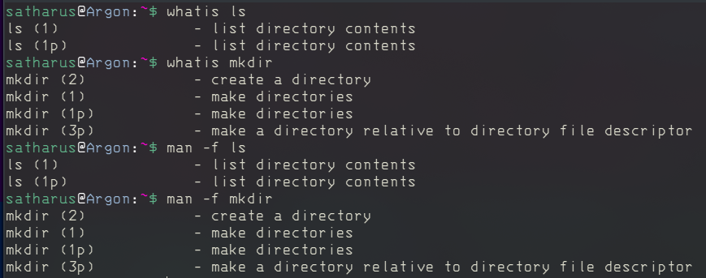

-----------------
## Managing Directories and Files
### File Extensions
A file extension is the ending of a file’s name that helps the operating system and the user know the kind of file it is and what program should run to open this file.

By default Linux has 3 types of files:
1. Regular file(-):
     - Readable file (.txt, .cpp)
     - Binary file (.exe)
     - Image file (.png, .jpg)
     - Archive or Compressed file (.zip, .rar)
2. Directory(d): A folder containing files or folders
3. Special:
     - Block File(b): Hardware files (Like some files under /dev/)
     - Soft "Symbolic" link file(l): File pointing to another file (shortcut)

### Creating Directories

You now know how to use man. Can you search for a command that makes a directory ?
______
______
______
**Solution:** ```man -k "make dir"``` and the command is: ```mkdir```

**Example:**


**Note: We use double quotes ``“ ”`` if the name of the directory has more than one word.

This is to avoid making the shell interpret the 2 words as 2 separate arguments.

If you want to create more than one directory at a time you can do the following:


Let's check:


### Creating Files ###
You can use ``touch`` to create a file, like`` mkdir`` you can pass as many arguments to it and it’ll create the files for you.

**Example:**

You want to create 2 files:``touch file1 file2``

### Copying Files ###
To copy files you can use:``cp``

**Example:**

To copy a file, the following syntax can be used:``cp <source file> <destination file>``

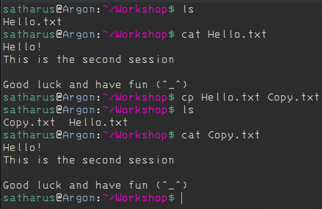

## Renaming and Moving Files ##
To rename a file use: ``mv``
**Example:**

Create a file that is called file1 and rename it to textfile.


To move “cut” a file use`` mv``

**Example:**
Moving "textfile" from ~/one to ~/two


### Deleting Files and Directories
You can delete a file or a directory using the ```rm``` command.

- Try to figure it out from the man pages on your own scroll down
- Find how to do the following:
    - Delete a file.
    - Delete an empty directory.
    - Delete a non empty directory.
    - Delete a file but ask for confirm before.
    - Delete by force and don't prompt the user.
_____
_____
_____
_____
**Solution:**

- ```rm filename```

- ```rm -d directory_name``` OR ```rmdir directory_name```

- ```rm -r directory_name```

- ```rm -i filename```

- ```rm -f filename```


## Links ##
### What are Links? ###
A link in Linux is a file that points to another file/directory. Creating links is similar to creating shortcuts. A file can have multiple links linked to it. But a link can only be linked to (pointed to) one file.

There are two types of links:
  1. Soft or Symbolic links.
  2. Hard links.

_These links behave differently when the source of the link (what is being
linked to) is moved or removed._

**→ Symbolic links are not updated, and become “hanging links”.**

**→ Hard links always refer to the source(inode), even if moved or removed.**

**For example:** 

We have a file A.txt if we create a soft link and a hard link both pointing to it and then delete A.txt, the result is visible in the opposite figure.

We can simply say that a soft link is just a file that points to another, while a hard link is a copy of a file that is always synchronized with it.

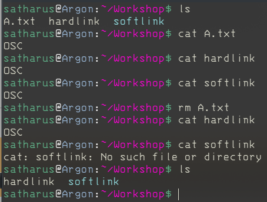

**Note:** You can think of links like pointers in programming languages, if you’re familiar with them.

### Soft “Symbolic” Links ###
- _A soft link is similar to the file shortcut feature which is used in Windows operating systems._
- _Soft links can be linked across different filesystems, although if the original file is deleted or moved, the soft link will not work correctly and is referred to as a “hanging link”._
- _Soft links contain the path for original file but not the content._
- _A soft link can link to a directory._

**Example:**
Make a link using the`` ln ``command.

The option ``-s`` makes the link a soft link and not a hard one.


You can see that indeed, S_Link is pointing to File.txt

### Hard Links ###

- _A hard link is similar to creating a copy that is always synced with the original file._
- _Hard links can’t be made across different file systems. But, if the original file is deleted or moved, the hard link will still work._
- _A hard link can’t link to a directory._

**Example:**

Make a hard link using the ``ln`` command.


In this example you can see that H_Link is treated as a normal file, it is just linked to File.txt. After editing File.txt, H_Link was edited too.

It is exactly like a synced copy of the file.

### Deleting Links ###
To delete a link you can use ``unlink`` or ``rm``

**Example:**

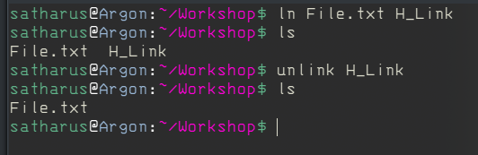

And since a link is a file after all, you can also delete it with ```rm```.

**Example:**


----------------------------------------
## SSH ( Secure Shell )

SSH is a network communication protocol that allows users to securely access remote computers and servers. It is often used to "login" and perform operations on remote computers but it may also be used for transferring data.

An inherent feature of ssh is that the communication between the two computers is **encrypted** meaning that it is suitable for use on insecure networks.

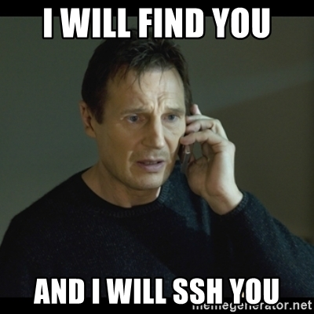

### Syntax:
````
ssh user_name@host(IP/Domain_name)
````
**Break it down :**
- **ssh** : instructs the system to establish an encrypted secure connection with the host machine.
- **user_name:** represents the account that is being accessed on the host.
- **host:** refers to the machine which can be a computer or a router that is being accessed. It can be an IP address (e.g. 192.168.33.1) or domain name(e.g. www.domainname.com).

**Note:** After logging into the host computer, commands will work as if they were written directly to the host terminal.

**Example:** Accessing parrot machine (linux distro) via windows10 command prompt using ssh to make a new file

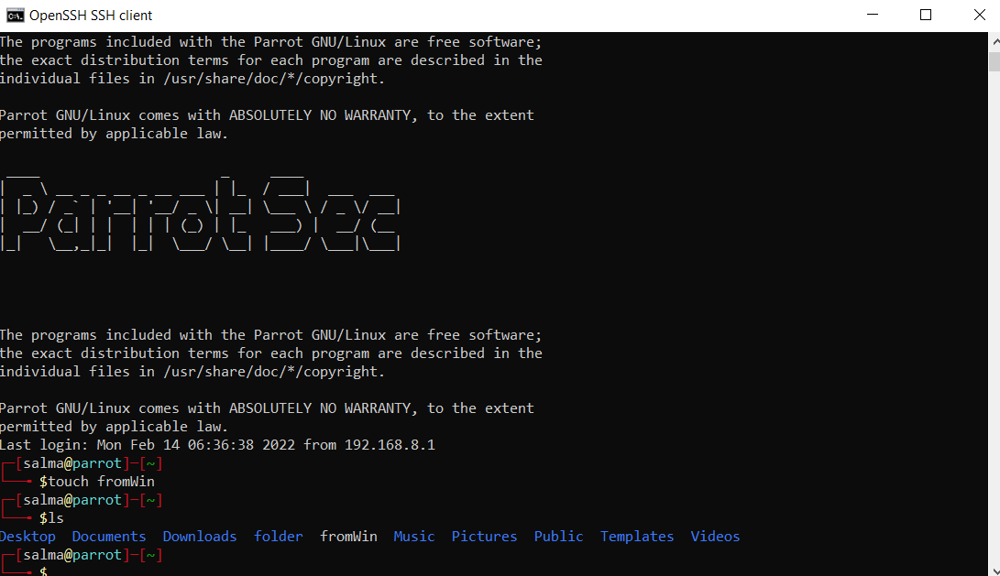    

   --------------
   
   ### Let's Play with [Bandit](https://overthewire.org/wargames/bandit/)

