# Session#3

# Text Editors, I/O Redirection & Permissions

# CLI Text Editors

## GNU Nano

GNU Nano or Nano for short, is a text editor for Unix-like computing systems or operating environments using a command line interface(CLI).

I.e Linux, Unix, macOS, etc..

To start using nano we can simply run it from the terminal by running the command ``nano``.

We can write whatever text we want and once we’re done we can exit using the shortcut Ctrl + x, we’ll be prompted to enter the name of the file to save as.

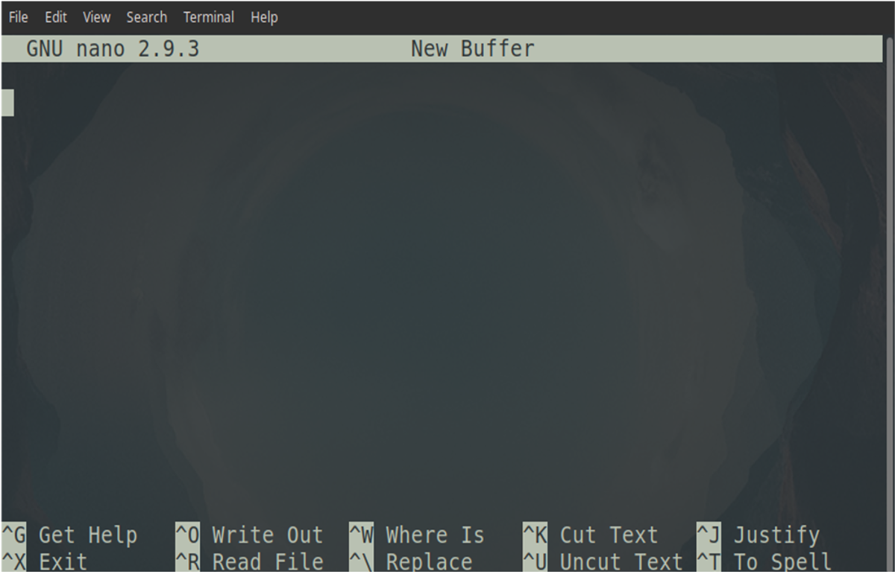

Another way to open nano is to write nano in the terminal followed by the file name or the absolute path of the file we want to edit and if the file doesn’t exist it will be created.

Example: ```nano /etc/fstab``` or ```nano file.txt```

## Vim

Vim is a highly configurable text editor built to make creating and changing any kind of text very efficient. It's the default editor on all
POSIX systems. Whether you've just installed the operating system, or you've booted into a minimal environment to repair a system, or you're unable to access any other editor, Vim is sure to be available. While you can swap out other small editors, such as GNU Nano or Jove, on your system, it's Vim that's all but guaranteed to be on every other system in the world.

### Model editing
- **Normal:** for moving around a file and making edits
- **Insert:** for inserting text
- **Visual:** for selecting blocks of text
- **Replace:** for replacing text
- **Command-line:** for running commands

To start using Vim we can simply run it from the terminal by running the command ``vim``.

You can also add a file to open it with Vim. To do so, type `vim <FILE NAME>`. By default, you starting *Visual mode*. To change into insert mode, press the `i` key on your keyboard. Now, you can type like a normal text editor.

After you finish writing, press the `Esc` key to return to *visual mode*.

If you want to save the file, make sure that you're in *visual mode* and press `:` key to get into *command-line mode* and type `w` to write the changes made on your file.

To quit Vim, enter the *command-line mode* and write `q` to quit and `q!` to quit without saving changes.


Vim is very configurable and customizable. You can take it from this:

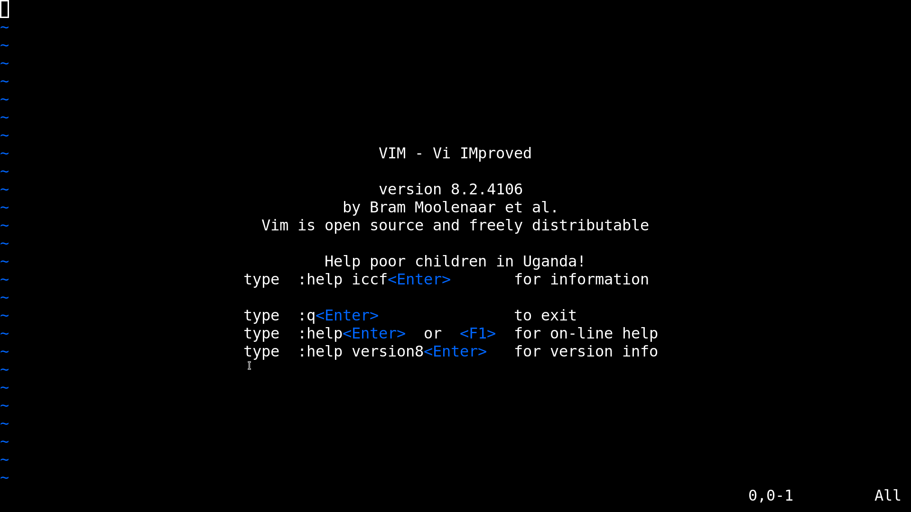

to this:

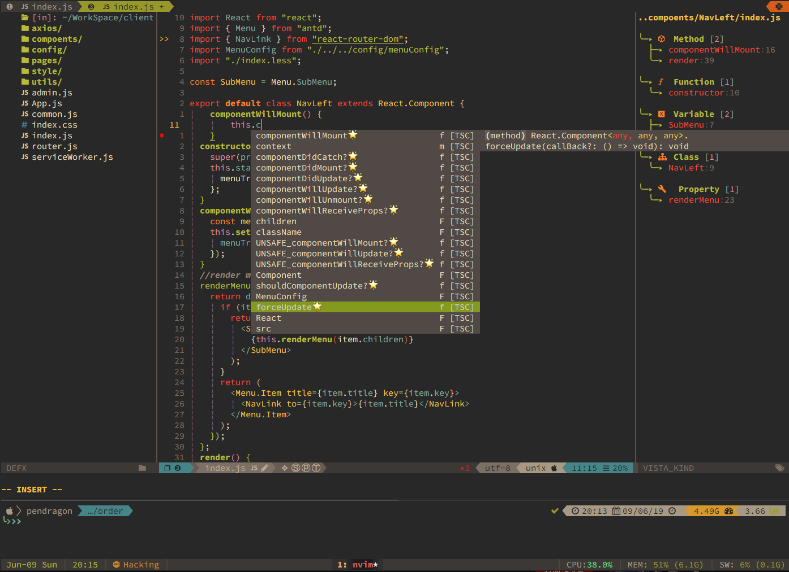


# Working on files

## Input and Output Streams and Redirection

### Unix Philosophy
#### "Do One Thing and Do It Well"
The ideology of doing small pieces of software and connecting them together to form a bigger, more powerful software is what
makes Unix-like operating system so efficent. This ideology was first developed at AT&T Bell Labs by Doug McIlroy and Ken Thompson.

<p float="left">


</p>

### Input and Output Streams

For every program, even operating systems, there is what we call standard input
and output streams, they are used to take input from the user “standard
input(stdin)”, and give the user output “standard output(stdout) and standard
error(stderr)”.


These channels are the way to interact with any program, for example in Linux we
can give the computer orders in the form of commands through the shell we call
this stdin, an example for stdin will be **ls** or any other command, and the
computer responds with either stdout or stderr depending on the input.

Running ``ls`` gives normal output, thus channeled to stdout:


Running ``hello`` or any unknown command or syntax will give an error, thus channeled to stderr:    

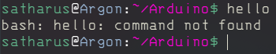

Notice that in the previous examples, both the output and the error were printed
to terminal as we haven’t redirected either of them.

### I/O Redirection

We can redirect stdout into file by using the greater than sign **>**.

Example:

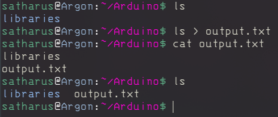

Notice that the output of the command was printed into the file instead of the
terminal.

We can redirect stderr into file by using the sign **2>**.

Example:

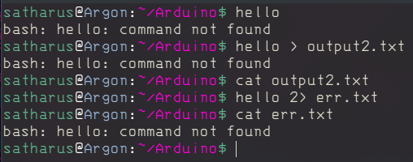

Notice that the output here stayed on the terminal although we redirected stdout, that is because the type of the output is stderr. That’s why when we used **2>** it redirected it into a file, but **>** didn’t.

Using **>** will override what’s in the file, to append to the file without deleting its content we can add another greater than sign **>>**.

We can also use **&>** to redirect both STDOUT and STDERR.

You can also redirect input from a file into a program using the smaller than sign **<** followed by the filename. 

**Example:** ``./program < inputfile.txt``

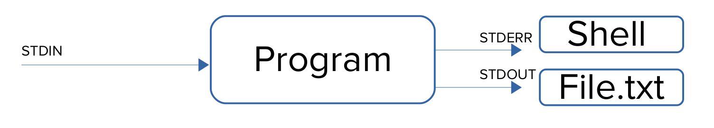

### Piping **‘ | ’**

As we mentioned before, Linux allows us to manipulate those streams the way we want. One feature we can use is piping by using the or operator ‘ | ’ or as we call it the pipe.

What the pipe does is that it takes any output passed to it then uses it as an input
for the following command.

Example: ```ls -l | grep “Desktop”```

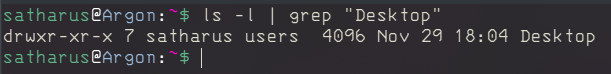

Executing this command will first list the directories in the current location and take this output rather than printing it, it passes it to the grep utility to filter out the lines that don’t contain “Desktop”.

We can use the pipe as many times as we want and to perform multiple commands sequentially with the I/O relations.

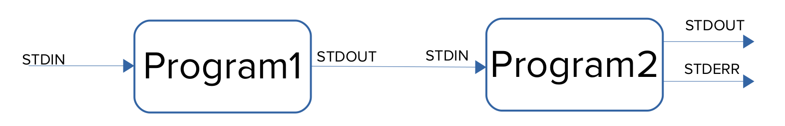

The figure above illustrates how piping works.

## File Permissions

What permissions are
When we say permissions we usually refer to the type of access a certain user or group can have on a file.

The three permissions we have are:

- **Read:** Which allows the user to view the content of a file.

- **Write:** Which allows the user to edit on a file.

- **Execute:** Which allows the user to run or execute a file.

To list permissions we use the command `ls` with the option `-l` which lists the files and directories in a list format.

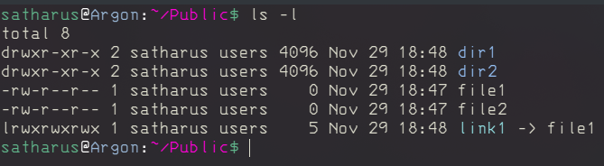

We can see at the beginning of every line there are a few sections:

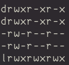

The first column is our focus

**[TYPE][OWNER PERMISSIONS][GROUP PERMISSIONS][OTHER PERMISSIONS]**

**Type:** This could be **d** for directory, **-** for file, **l** for link.

### Permissions:

The three permissions are read **‘r’**, write **‘w’**, and execute **‘x’**.

The first three are the permissions for the owner of the file, the second three are for the group, the last three are for any users that are not in the two previously mentioned categories (others).

**Example:** Taking file1 as an example, The permissions are:

Owner: Read, Write.

Group: Read only.

Others: Read only.

And we know from the – at the start that the file is a regular file, not a directory of a link.

### Changing Permissions

To change permissions we use the command ``chmod``, and permissions are represented in 2 ways.

- **Absolute “Numeric” Method:**

We can use the command ``chmod`` followed by a 3 digit number then the file we want to change its permissions.

**Example:** ```chmod 764 file```

Each digit corresponds to a group of the three mentioned above and the value of the digit is the new permissions we’re giving the file, for each permission we have a number x = 1, w = 2, r = 4 so the command will set the owner’s permissions to read, write, execute (rwx) and the group to read and write (rw-) and others to read only (r--).

- **Symbolic Method:**

Another way to change permissions is by referencing the group and the
permissions.

u – Owner
g – Group
o – Others
a – All users

**Example:** ``chmod u=rw file``

This example sets the permissions of the owner to read and write only.

We can also use + and – to append or remove a certain permission.

Example: ``chmod u+x file``

This example appends the execute permission to the owner of the file.

### Changing Ownership

The owner of the file is usually the user who created it or anyone who was given ownership of the file.

The third and fourth columns of the output of the ``ls -l`` command show the user owner and the group owner of the file respectively.

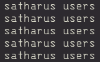

You can change the ownership of the file by using the command ``chown`` to change the user ownership and ``chgrp`` to change the group ownership.

**Example:** ``chown lightdm dir2``


**Example:** ``chgrp wheel dir1``


# Test yourself:

Let’s have some fun, if you don’t get something from the first time don’t worry!

1. Nano, reading files, redirection, and compilation

        a) Create a file named file1.txt.
        
        b) Use the command “ echo ” to redirect the text “HELLO” into the file.
        
        c) Check that the file contains “HELLO” without using nano.
        
        d) Edit the file without using a GUI text editor to contain “GOODBYE”.
        
        e) Find the line number that contains the word “GOODBYE” without using
        
        f) Write a C++ program that does whatever you want.
        
        g) Compile the C++ program to produce an executable called “OSC”.
        
        
2. Permissions and Ownership

        a) Create 2 files named filex and filey.
        
        b) Create 2 directories named dirx and diry.
        
        c) Change the permissions of filex to become NO PERMISSIONS for any of the users, using either of the methods.
        
        d) Change the permissions of filey to become (rw)(rx)(wx).
        
        e) Change the owner of dirx to root.
        
        f) Change the group of diry to root.
        
_______
_______
_______
**Solution:**

1. Nano, reading files, redirection, and compilation

        a) touch file1.txt
        
        b) echo “HELLO” > file1.txt
        
        c) cat file1.txt
        
        d) nano file1.txt
        
        e) cat -n file1.txt | grep "GOODBYE"
        
        f) Just use Nano.
        
        g) g++ filename -o OSC
        
        
2. Permissions and Ownership

        a) touch filex filey
        
        b) mkdir dirx diry
        
        c) chmod 000 filex
        
          chmod a= filex
        
          chmod u=,g=,o= filex
        
        d) chmod 653 filey
        
          chmod u=rw,g=rx,o=wx filey
        
        e) sudo chown root dirx
        
        f) sudo chgrp root diryr
