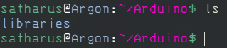
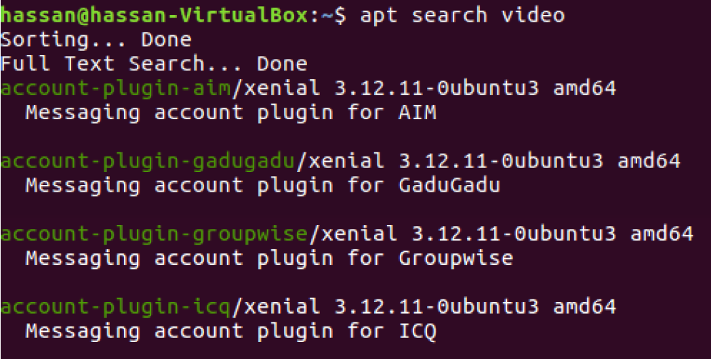

# Session 3

# Text Editors, I/O Redirection & Permissions

# CLI Text Editors

## GNU Nano

GNU Nano or Nano for short, is a text editor for Unix-like computing systems or operating environments using a command line interface(CLI).

I.e Linux, Unix, macOS, etc..

To start using nano we can simply run it from the terminal by running the command ``nano``.

We can write whatever text we want and once we’re done we can exit using the shortcut Ctrl + x, we’ll be prompted to enter the name of the file to save as.


Another way to open nano is to write nano in the terminal followed by the file name or the absolute path of the file we want to edit and if the file doesn’t exist it will be created.

Example: ```nano /etc/fstab``` or ```nano file.txt```

## Vim

Vim is a highly configurable text editor built to make creating and changing any kind of text very efficient. It's the default editor on all
POSIX systems. Whether you've just installed the operating system, or you've booted into a minimal environment to repair a system, or you're unable to access any other editor, Vim is sure to be available. While you can swap out other small editors, such as GNU Nano or Jove, on your system, it's Vim that's all but guaranteed to be on every other system in the world.

### Model editing
- **Normal:** for moving around a file and making edits
- **Insert:** for inserting text
- **Visual:** for selecting blocks of text
- **Replace:** for replacing text
- **Command-line:** for running commands

To start using Vim we can simply run it from the terminal by running the command ``vim``.

You can also add a file to open it with Vim. To do so, type `vim <FILE NAME>`. By default, you starting *Visual mode*. To change into insert mode, press the `i` key on your keyboard. Now, you can type like a normal text editor.

After you finish writing, press the `Esc` key to return to *visual mode*.

If you want to save the file, make sure that you're in *visual mode* and press `:` key to get into *command-line mode* and type `w` to write the changes made on your file.

To quit Vim, enter the *command-line mode* and write `q` to quit and `q!` to quit without saving changes.


Vim is very configurable and customizable. You can take it from this:


to this:


# Working on files

## Input and Output Streams and Redirection

### Unix Philosophy
#### "Do One Thing and Do It Well"
The ideology of creating small pieces of software and connecting them together to form a bigger, more powerful software is what
makes Unix-like operating system so efficient. Unix-like OSs is powerful in part because of high composability. 
This ideology was first developed at AT&T Bell Labs by Doug Mcilroy and Ken Thompson under the name of I/O Redirection and Piping. 

<p float="left">


</p>


### Input and Output Streams

All programs launched on the operating systems has three streams:
- **STDIN:** when the program reads input, it comes from here.
- **STDOUT:** when the program prints something, it goes here.
- **STDERR:** a 2nd output the program can choose to use (usually for error messages).

By default, **STDIN** is your keyboard, **STDOUT** and **STDERR** are both your terminal.


These channels are the way to interact with any program, for example in Linux we
can give the computer orders in the form of commands through the shell we call
this stdin, an example for stdin will be **ls** or any other command, and the
computer responds with either stdout or stderr depending on the input.

Running ``ls`` gives normal output, thus channeled to stdout:



Running ``hello`` or any unknown command or syntax will give an error, thus channeled to stderr:    


Notice that in the previous examples, both the output and the error were printed
to terminal as we haven’t redirected either of them.

### I/O Redirection

We can redirect stdout into file by using the greater than sign **>**.

Example:


Notice that the output of the command was printed into the file instead of the
terminal.

We can redirect stderr into file by using the sign **2>**.

Example:


Notice that the output here stayed on the terminal although we redirected stdout, that is because the type of the output is stderr. That’s why when we used **2>** it redirected it into a file, but **>** didn’t.

Using **>** will override what’s in the file, to append to the file without deleting its content we can add another greater than sign **>>**.

We can also use **&>** to redirect both STDOUT and STDERR.

You can also redirect input from a file into a program using the smaller than sign **<** followed by the filename. 

**Example:** ``./program < inputfile.txt``


### Piping **‘ | ’**

As we mentioned before, Linux allows us to manipulate those streams the way we want. One feature we can use is piping by using the or operator ‘ | ’ or as we call it the pipe.

What the pipe does is that it takes any output passed to it then uses it as an input
for the following command.

Example: ```cat /etc/passwd | tail -n 3```


Executing this command will first send the content of the file to **STDOUT** then the pipe will take it and use at as **STDIN** to the `tail -n 3` command which will show the last three lines of the file.

We can use the pipe as many times as we want and to perform multiple commands sequentially with the I/O relations.


The figure above illustrates how piping works.

You can do all sort of fun things with pipes. For example: `fortune | cowsay | lolcat`.

`fortune` will print an adage and pipe it to `cowsay` which will draw an ascii art of a cow speaking and then this output will be piped to `lolcat` which will give the output the colorful look.


**Extras:** [Creating a program that convert man pages into PDFs and preview them in a menu using pipes only](https://www.youtube.com/watch?v=8E8sUNHdzG8)

## File Permissions

When we say permissions we usually refer to the type of access a certain user or group can have on a file.

The three permissions we have are:

- **Read:** Which allows the user to view the content of a file.

- **Write:** Which allows the user to edit on a file.

- **Execute:** Which allows the user to run or execute a file.

To list permissions we use the command `ls` with the option `-l` which lists the files and directories in a list format.


We can see at the beginning of every line there are a few sections:


The first column is our focus

**[TYPE][OWNER PERMISSIONS][GROUP PERMISSIONS][OTHER PERMISSIONS]**

**Type:** This could be **d** for directory, **-** for file, **l** for link.

### Permissions:

The three permissions are read **‘r’**, write **‘w’**, and execute **‘x’**.

The first three are the permissions for the owner of the file, the second three are for the group, the last three are for any users that are not in the two previously mentioned categories (others).

**Example:** Taking file1 as an example, The permissions are:

Owner: Read, Write.

Group: Read only.

Others: Read only.

And we know from the – at the start that the file is a regular file, not a directory of a link.

### Changing Permissions

To change permissions we use the command ``chmod``, and permissions are represented in 2 ways.

- **Absolute “Numeric” Method:**

We can use the command ``chmod`` followed by a 3 digit number then the file we want to change its permissions.

**Example:** ```chmod 764 file```

Each digit corresponds to a group of the three mentioned above and the value of the digit is the new permissions we’re giving the file, for each permission we have a number x = 1, w = 2, r = 4 so the command will set the owner’s permissions to read, write, execute (rwx) and the group to read and write (rw-) and others to read only (r--).

- **Symbolic Method:**

Another way to change permissions is by referencing the group and the
permissions.

u – Owner
g – Group
o – Others
a – All users

**Example:** ``chmod u=rw file``

This example sets the permissions of the owner to read and write only.

We can also use + and – to append or remove a certain permission.

Example: ``chmod u+x file``

This example appends the execute permission to the owner of the file.

### Changing Ownership

The owner of the file is usually the user who created it or anyone who was given ownership of the file.

The third and fourth columns of the output of the ``ls -l`` command show the user owner and the group owner of the file respectively.


You can change the ownership of the file by using the command ``chown`` to change the user ownership and ``chgrp`` to change the group ownership.

**Example:** ``chown lightdm dir2``


**Example:** ``chgrp wheel dir1``


# Text Processing & Manipulation

## Creating files

First, let's learn how to create a new empty file from the terminal. To do so, use `touch` command.

`touch foo.txt`


**Question:** How to write "This file is named foo" into `foo.txt` without opening it?

**Solution:**


**Note:** There's lots of other ways to create files in Linux. 

## Viewing files

Now, let's view the file by sending its content into `STDOUT`. To do so, use `cat` command.


But what if the file was too big that it won't fit in the terminal? Would it be write to use `cat`? 

In such cases, we use the `less` command.

Try `cat /var/log/syslog` vs `less /var/log/syslog`. What is the difference?

Another case might be wanting to view the first *n* lines of a file or the last *n* lines. Here, you can use `head` & `tail` commands to get your job done.

To view the first 3 lines of a file you can use:

`cat /etc/passwd | head -n 3` (meh)

`head -n 3 /etc/passwd` (correct way)

Replace `head` with `tail` to view the last 3 lines of a file.


## Text Manipulation

When dealing with files through the terminal, you might find yourself in need to preform some operation on the text
to get it in the desired form. Unix-like OSs are very powerful when it comes to text manipulation and filtering.

Let's say that you have a file that looks like this:

```
8,Steve Bourne,Bourne sh 
3,Doug Mcilroy,Pipes
1,Ken Thompson,Unix Operating System
9,Stuart Feldman,make
6,Alfred Aho,egrep
4,Brian Kernighan,AWK Programming Language
5,Steve Johnson,Yacc
2,Dennis Ritchie,C Programming Language
7,Lorinda Cherry,Unix mathematical tools
```

**NOTE:** This file is a `.csv` file ([comma-separated values](https://en.wikipedia.org/wiki/Comma-separated_values)).

First, let's learn how to sort this file. To do so, I will pipe the content of the file into `sort` command.


The `sort` command is used to sort what it receives from standard input.

Now, our file is sorted. I am thinking about using all uppercase letters instead of uppercase & lowercase in my text.

To get this done, I will use the `tr` command.


The `tr` command allows you to translate a set of characters into another set of characters.

Moreover, let's show only names of the people who creating programming languages. We need a program that searches
for a word, in our case "programming language", and view the line containing this word. This program is `grep`.


For some reason, it didn't work. Can you guess why?

This happened because we are search for "programming language" in lowercase and our output is in uppercase.
Our workaround is to remove `tr` from the line, right? But we want our output to be in uppercase so we will have to add it again. 

Let's open the man page for `grep` and see if we can find anything. 


Press `/` on your keyboard to invoke the search functionality. Write "case" and hit enter.


The first highlighted instance of "case" keyword shows that using `-i` option will ignore the case of the letters.

Now let's use it on our file


It worked!. Now we know who created programming languages among our list.

The grep command is quite possibly the most common text processing command you will use.
 
# Users and Groups
 
In any traditional operating system, there are users and groups. They exist solely for access and permissions.
When running a process, it will run as the owner of that process whether that is Jane or Bob.
File access and ownership is also permission dependent. You wouldn't want Jane to see Bob's documents and vice versa.

Each user has their own home directory where their user specific files get stored, this is usually located in **/home/username**, but can vary in different distributions.

**The system uses user ids (UID) to manage users, usernames are the friendly way to associate users with identification, but the system identifies users by their UID.**

**The system also uses groups to manage permissions, groups are just sets of users with permission set by that group, they are identified by the system with their group ID (GID**).

In Linux, you'll have users in addition to the normal humans that use the system. Sometimes these users are system daemons that continuously run processes to keep the system functioning. 
**so the user can be :**
- a user account for a real user (i.e a human) 
- a system user associated with a service or a program. 

One of the most important users is **root or superuser**, root is the most powerful user on the system,it is like a guy who has all the powers to add users to del user to create new groups to remove someone from group. To give someone permissions and can also access local files like /etc/shadow /etc/passwd. Whereas user has no powers to modify internal 
files and also don't have privelege to access some internal files. Also they can't give execute permission to files in root folder.
For that reason, it can be dangerous to operate as root all the time, you could potentially remove system critical files. 


###  ownership of Linux files:

- **User**: the owner of the file (person who created the file).

- **Group**: the group can contain multiple users. Therefore, all users in that group will have the same permissions. 
         
- **Other**: any person has access to that file, that person has neither created the file, nor are they in any group which has access to that file.

- **Root**: who has all the powers to do anything.

**Note:** If root access is needed and a user has root access, they can use sudo command (superuser do) that is used to run a command with root access.

## Usres

#### UserID
 A userID is a positive integer assigned to the user to identify it:

- UID 0 - Root user
- UID 1 - 999 - System and Program users
- UID >= 1000 - Real users


You can know any user’s ID and the groups that they’re in by using the command 
```
id <username>
```
for example


#### System Users
The users of the system are stored in the /etc/passwd file.


**lets have a look on /etc/passwd file**


Looking at the content of the file here, we can see that:
 - the root user is the first with UID 0. 
 - We have system users ranging from 1 to 120.
   Example: lightdm has a UID of 108, it is a display manager, a system application.
 - The final  line have the **first real user created** on the system : Hassan, UID 1000 .

#### Adding and deleting users

To create a user, simply enter the command:
```
sudo useradd -m <username>
```

**Breaking it down**

```sudo```: Needed because you need administrator privilege to create a new a user.

```useradd```: The command used to add users.

```-m```: An option used to make a home directory for the new user by default.

**Create another user**

If we create a user named temp and check the content of the etc/passwd file
again:


**To delete a user use :**
```
sudo userdel <username>
```

#### Setting password for users

To set or change a password for a user, we use the command
```
sudo passwd <username>
```

It’ll then prompt you to enter the password.

#### Switching Users

To switch user, we use the command
```
su username
```
Then you’ll be prompted to enter the password


To return to original user enter the command
```
exit
```


## Groups

#### List All Groups
```
less /etc/group
```
 


#### Adding and Deleting Groups

To create a new group, use the command
```
sudo groupadd <groupname>
```
 

To delete a group, use the command
```
sudo groupdel <groupname>
```
#### Types of Group

In Linux there are two types of group; 

- **Primary group** – Specifies a group that the operating system assigns to files that are created by the user. Each user must belong to only one primary group.

- **Secondary groups** – Specifies one or more groups to which a user also belongs. A user can be added in multiple secondary groups. (Secondary group is optional.)

#### User Modification

Every user has 1 primary group and supplementary groups, to modify any user we
use the command 
```
usermod
```
To change the primary group we’ll add the option 

```-g new_primary_group```

To change the supplementary groups we’ll add the option

```-G new_supplementary_groups```


However this will overwrite the current supplementary groups a user has.

If we want to append the stated groups, we’ll add the a option to append

```-aG new_supplementary_groups```

**Example**
```
usermod -g prim_group -aG sup_groups user
```

_________________________________

# Package managers

### Packages and Repositories 

A package is essentially an archive file(collection of files) containing the binary executable, configuration file and sometimes information about the dependencies.

A package is usually referred to an application but it could be a GUI application, command line tool , a software library (required by other software programs) or even documentation.  

Linux distributions created their own packaging format to provide the end users ready-to-use binary files (precompiled software) for installing software along with some metadata (version number, description) and dependencies.

Packages in Linux are stored in repositories where the package manager can easily find, download, and install them.

**Repositories** can be considered something like an app store, that has many packages on it, and you choose to install and upgrade packages from it.


### Package Dependencies

A package required for another package to work.
if the dependencies aren't there the package will end up in a broken state and most of the time not even install.


### Package Manager

A package manager is a tool that allows users to install, remove, upgrade, configure and manage software packages on an operating system. The package manager can be a graphical application like a software center or a command line tool like apt-get or pacman.

It consists of high and low level parts.

- The **high level** package manager, called *apt* or *apt-get* in Debian-based distributions, it is responsible for searching the repositories and finding the packages, it is also responsible for resolving dependencies.

   For example: The program GIMP requires a toolkit called GTK+ to work, so the package manager automatically installs GTK+ when installing GIMP.

- The **low level manager**, called *dpkg* in Debian-based distributions, is the one responsible for the actual **installation** and **compilation** of the packages.

### How does the package manager work


Almost all Linux distributions have software repositories which is basically collection of software packages. Yes, there could be more than one repository. The repositories contain software packages of different kind.
Repositories also have metadata files that contain information about the packages such as the name of the package, version number, description of package and the repository name etc.

Your system’s package manager first interacts with the metadata. The package manager creates a local cache of metadata on your system. When you run the update option of the package manager **(for example apt update)**, it updates this local cache of metadata by referring to metadata from the repository.
When you run the installation command of your package manager, the package manager refers to this cache. If it finds the package information in the cache, it uses the internet connection to connect to the appropriate repository and downloads the package first before installing on your system.
A package may have dependencies. Meaning that it may require other packages to be installed. The package manager often takes care of the dependencies and installs it automatically along with the package you are installing.


### Installing and Removing Packages

To install a package, we use the command
```
sudo apt install packages_names
```


In this example, vim-runtime is considered a dependency, as vim needs it to work, the package manager notified us that it’ll be installed alongside vim.

To remove a package, we use the command
```
sudo apt remove package_name
```

### Searching for Packages

To search for packages, enter the command
```
sudo apt search <keyword>
```

## 

### Updating and Upgrading

As mentioned before, packages are downloaded from repositories, which can be considered a storage for packages. However after a while the packages get updated and maybe new packages are added, the local repository data on your system may get outdated so you need to update the local data.

The command ```apt update``` will update the links inside the repository data file so that when you download or update something from the repository you’ll get the latest version.

As for the command ```apt upgrade``` it upgrades all the packages on your system to their latest versions available in the repositories.

______

# Processes

Every time you run a shell command, a program is run and a process is created for it. When we say we are running a program we are not really running the program but a copy of it which is called a process. What we do is copy those instructions and resources from the hard disk into working memory (or RAM). We also allocate a bit of space in RAM for the process to store variables (to hold temporary working data) and a few flags to allow the operating system to manage and track the process during it's execution.

Linux is a multitasking operating system, which means that multiple programs can be running at the same time (processes are also known as tasks). Each process has the illusion that it is the only process on the computer. The tasks share common processing resources (like CPU and memory).

**For example** I could have two terminals open and be running the command cp in both of them. In this case there would be two cp processes currently existing on the system. Once they are finished running the system then destroys them and there are no longer any processes representing the program cp.

When we are at the terminal we have a Bash process running in order to give us the Bash shell. If we start a script running it doesn't actually run in that process but instead starts a new process to run inside. 

**Each process in Linux has a process id (PID) and it is associated with a particular user and group account.**

### Types of Processes

- **Foreground processes** (non automatic):
   - these are initialized and controlled through a terminal session. There has to be a user connected to the system to start such processes; they haven’t started automatically as part of the system functions/services. such as Google Chromium, Firefox, GIMP, Codeblocks, etc..

- **Background processes** (automatic processes) :
    - Not connected to a terminal; they don’t expect any user input.
    - Can't seen by the user, this will include things such as update managers, network managers, etc...

### What is Daemons
These are special types of background processes that start at system startup and keep running forever as a service; they don’t die. They are started as system tasks (run as services), spontaneously. However, they can be controlled by a user via the init process.

### PS and Top Commands

The ```ps``` command is responsible for telling you all the processing currently running on the terminal


- PID: Process ID
- TTY: Controlling terminal associated with the process.
- TIME: Total CPU usage time
- CMD: Name of executable/command


```ps aux``` will show you ALL of the processes running on the system.

The ```top``` command will tell you all the current processes running in the system, and update them if any processes are killed or changed.


If you look at the figure above, you’ll see a command with the PID 1 called systemd, this is the initialization service responsible for the whole system after booting.

### Signals

A signal is a notification to a process that something has happened.( command sent by the system to a process)

**Why we have signals**

They are software interrupts and they have lots of uses:

- A user can type one of the special terminal characters (Ctrl-C) or (Ctrl-Z) to kill, interrupt or suspend processes
- Hardware issues can occur and the kernel wants to notify the process
- Software issues can occur and the kernel wants to notify the process
- They are basically ways processes can communicate
Signal process

When a signal is generated by some event, it's then delivered to a process, it's considered in a pending state until it's delivered. When the process is ran, the signal will be delivered. However, processes have signal masks and they can set signal delivery to be blocked if specified. When a signal is delivered, a process can do a multitude of things:

**Ignore the signal**
- "Catch" the signal and perform a specific handler routine
- Process can be terminated, as opposed to the normal exit system call
- Block the signal, depending on the signal mask

The signal we’ll discuss today is called _sigkill_ which is responsible for **ending a process**.

**SIGKILL or KILL or 9: Kill**
 
 It is similar to **End Task** in Windows.

To send a sigkill, we can use the command
```
kill <PID>
```
Or we can use the command
```
killall <process_name>
```


Note: ‘#’means the start of a comment in the Linux shell.

