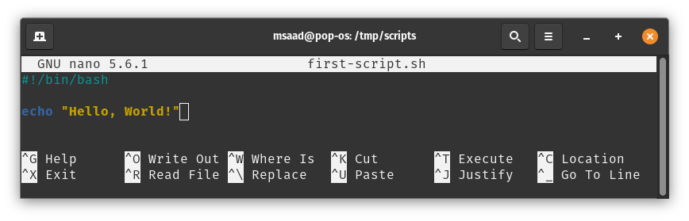

# Session 5

# Shell Scripting

## What are Shell Scripts?
Shell scripts are plain text files that contains a series of commands that will be excuted when the user runs the script. 
An important note is that anything you can run normally on the command line can be put into a script and it will do exactly the same thing and vice versa.

It is convention to give a script the **(.sh)** extension. This is not a must since Linux is a extensionless system. You can give it whatever extension
you want and it will still work as a shell script.

## First shell script!

As mention above, shell scripts are plain text files. Let's use our knowledge with CLI editors to create a new file and write to it. In this case, I will
use `nano`:

`nano first-script.sh`

