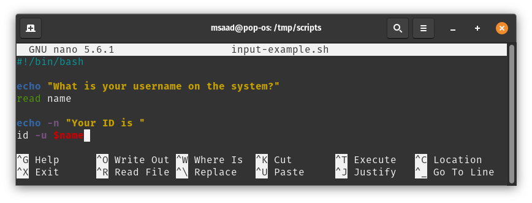
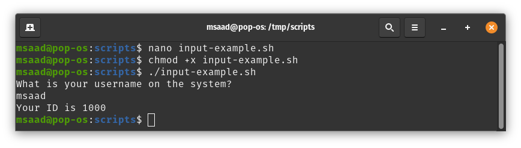
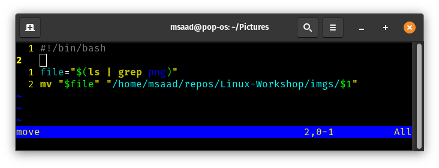
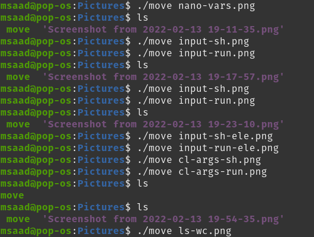
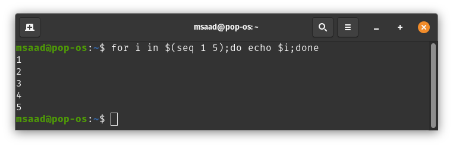
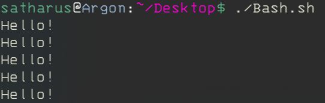
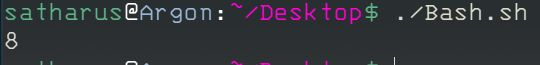
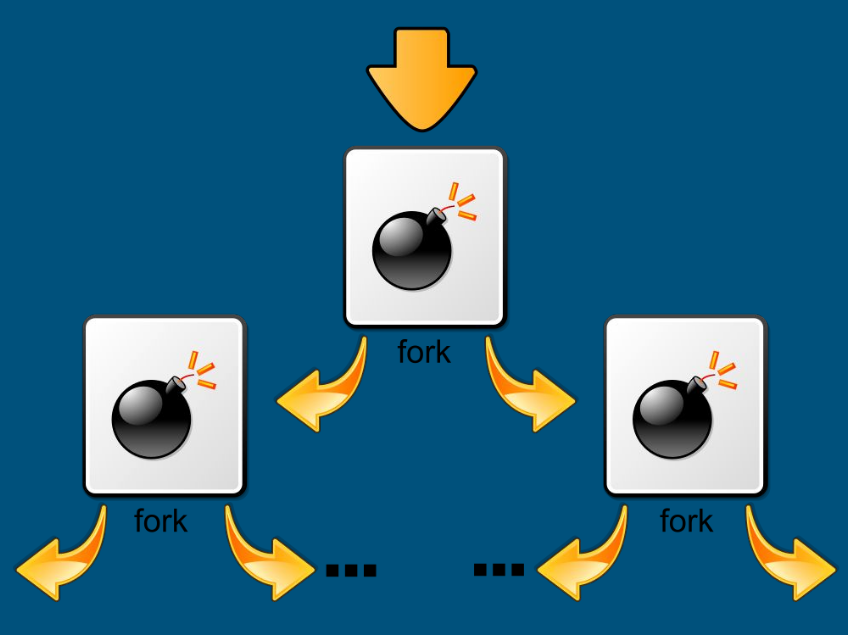

# Session 4

# Shell Scripting

## What are Shell Scripts?
Shell scripts are plain text files that contains a series of commands that will be executed when the user runs the script. 
An important note is that anything you can run normally on the command line can be put into a script and it will do exactly the same thing and vice versa.

It is convention to give a script the **(.sh)** extension. This is not a must since Linux is a extensionless system. You can give it whatever extension
you want and it will still work as a shell script.


## Why use it?
#### - Running a series of shell commands to:
* **Process Files**
  * Reading Files.
  * Checking if files exist
  * Checking if files have changed.
* **Automate Tasks**
  * Automating the backing up of data
  * Automating package installations
  * Automating updates
* **Using Linux Commands inside a program**
  * Use Linux commands inside programs 
  * Controlling the workflow of your system and commands.


### First shell script!

As mention above, shell scripts are plain text files. Let's use our knowledge with CLI editors to create a new file and write to it. In this case, I will
use `nano`:

`$ nano first-script.sh`


After saving this file, we now have our first shell script. To execute it, we first need to make it executable. To do so, use the `chmod` command:

`$ chmod +x first-script.sh`

Now our script is executable. To run it, prepend its name with `./` and press enter:

`$ ./first-script.sh`


### Let's break the everything down

#### The script

```bash
#!/bin/bash

echo "Hello, World!"
```

* `#!/bin/bash`: The **shebang**
    - Shebang (#!): This is the first line any script. Following it is the path to the interpreter that should be used to run (or interpret) the rest of the lines in the text file. In our case, it's the path to Bash `/bin/bash`. You can check the path to Bash by viewing the content of `/etc/shells` on your
    machine.

* `echo "Hello, World!"`: Bash command that will print a message to the screen. You can type this command yourself on a shell prompt and it will execute
as expected.

#### Why adding ./

This helps bash knowing you are executing this exact script that is found in the current working directory. On the other hand, when you run a command like `ls`, you don't add `./` because Bash knows where to find it. You can replace `./` with the full path of the script, `/tmp/scripts/first-script.sh` in my case. You also can do the same thing with system commands like `/usr/bin/ls`


## Variables

A variable is a temporary store for a piece of information. There are two actions we may perform for variables:

* Setting a value for a variable.
* Reading the value for a variable.

You can assign variables in various way. For instance, the most common way it to set the value of a variable directly after creating it. You can also save the output of a command into a variable (more on that later).

When reading a variable, we place `$` before its name to tell Bash that this word is a variable. This can be very useful when dealing with text bodies.
Before a line is executed, Bash replaces every variable prepended by `$` with its actual value. This process is repeated for every line in the script.

Variables names are case-sensitive and can't start with a number, but can start with an underscore.
* To assign a value to a variable:
  * `varname="text with spaces"`
  * `varname='text with spaces without any processing'`
  * `varname=textwithoutspaces`
  * `varname=20`
* BASH does NOT support floating point integers natively.
* You can also use \ as an escape character to prevent certain characters from being processed by the shell such as the space character:
  * `x=text with spaces` -> syntax error
  * `x=text\ with\ spaces` -> value of x = "text with spaces"
* `varname` -> refers to the variable.
* `$varname` -> refers to the value of the variable.

**Examples:**

Assigning variables and using them on command line:


Creating a script that does the same thing:


Running the script:


#### The Difference between ' ' and " "

* " " -> Interprets what's inside it, including any expressions, variables, etc..
* ' ' -> Interprets what's inside it literally, without calculating or expanding expressions.

**Example:**
`x=2`

`echo "$x"`  output->  **2**

`echo $x ` output-> **2**

`echo x`  output -> **x**

`echo 'x'` output-> **x**

`echo '$x'` output-> **$x**

### Taking Input from users

We can ask the user for input and save it into a variable using `read`. To illustrate, let's create a shell script that asks the user for his username on
the system and return his users id.




The script first reads input from user after prompting a question. Then it saves the user's input into a variable. After that, it executes the `id` command with the giving username read from the `name` variable. The `-u` flag used here is to only show the user id of the given user.



Now let's get the same job done more elegantly. You can use `read` with the `-p` flag to prompt the user with a question and take input at the same time.


### Taking input from users without variables (Command Line Arguments)

Command line arguments are nothing new to us. We introduced it in the second session when we explained the [command line syntax](https://github.com/mazzensaadd/Linux-Workshop/tree/master/session-2#the-command-line-syntax). Let's recap:

When we run a program on the command line you would be familiar with supplying arguments after it to control its behavior. For instance we could run the command `ls /etc`. `/etc` is a command line arguments to the command ls. We can do similar with our bash scripts. To do this we use the variables $1 to represent the first command line argument, $2 to represent the second command line argument and so on. These are automatically set by the system when we run our script so all we need to do is refer to them.

Let's create a new script that takes three names as command line arguments and print them in reversed order.


### Command Substitution

Command substitution allows use to save the output of a command as a value of a variable. To do so, we place the command that we want to save the output of in *brackets*, preceded by *$*:

Let's create a new script that lists the contents of `/etc` and counts it. To count an output line by line, we use `wc` command with the `-l` flag. For more information about `wc`, view its man page by executing `man wc`.


**Real Life Application:**

I am currently using command substitution and command line arguments to make my life easier while creating this content. 

Let me explain.

Throughout the process of creating this content, I am constantly taking screenshots of my terminal to add to the workshop content. By default, the
screenshots are saved in `~/Pictures` directory and I want to move them to `~/repos/Linux-Workshop/imgs` so that I can push them to the github repo
alongside with the content.

At first, I did this:


which doesn't seem much as first, but it got tedious with repetition so I created a simple script to help me.
The script is:



And I run it every time I take a new screenshot. It lists the content of the `~/Pictures` dir and greps the `.png` file. Then, it moves it to the desired
dir and give it the name I gave in as a command line argument.

Now, my workflow looks like this:



## Special Variable Types

### Environment Variables
* Global system variables accessible by all the processes running under the operating system.
* Environment variables are useful to store system-wide values such as the directories to search for the executable programs (PATH).

**Variables include:**
* `BASH_VERSION` Bash version.
* `HOST_NAME` Host name.
* `HOME` Home directory.
* `PATH` Executable locations.
* `TERM` Default terminal.
* `SHELL` Default shell.
* `EDITOR` Default text editor.

### Other Useful Variables

* $0 - The name of the Bash script.
* $1 - First argument to the Bash script.
* $# - How many arguments were passed to the Bash script.
* $@ - All the arguments supplied to the Bash script.
* $? - The exit status of the most recently run process.
* $$ - The process ID of the current script.
* $USER - The username of the user running the script.
* $HOSTNAME - The hostname of the machine the script is running on.
* $SECONDS - The number of seconds since the script was started.
* $RANDOM - Returns a different random number each time is it referred to.
* $LINENO - Returns the current line number in the Bash script.

## Arithmetic in Bash
* **You can do 6 basic arithmetic operators in Bash:**
  * `a + b` addition (a plus b)
  * `a - b` subtracting (a minus b)
  * `a * b` multiplication (a times b)
  * `a / b` integer division (a divided by b)
  * `a % b` modulo (the integer remainder of a divided by b)
  * `a ** b` exponentiation (a to the power of b)
* **Arithmetics can be done using the expression: $((expression))**
  * Example: `a=$((5 - 3 + $b))`
  * Which means: variable `a` is equal `=` to the value of `$()` the expression `(5 - 3 + $b)`


## Conditionals in BASH

## If statements

If conditions are used to control a program's flow, as in they control what a program does and when.


- Conditionals in C 
```C
if (x == 5)
{
    //DoSomething
}
```
```C
if (x == "String")
{
    printf("1");
}
else if (x == "String 2")
{
    printf("2");
}
else
{
   printf("3");
}
```
- Conditionals in BASH
```sh
if [[ $x -eq 5 ]]
then
    #DoSomething
fi
```
> “{“ ‘opening brace’ is roughly equivalent to `then` and “}” ‘closing brace’ is roughly equivalent to `fi`

```sh
if [[ $x = "String" ]]
then 
    echo 1
elif [[ $x = "String 2" ]]
then
    echo 2
else
    echo 3
fi
```

### Writing conditionals in BASH

- Start a condition with `if [[ condition ]]`
- The next line contains `then` which is roughly equivalent to `‘{‘`
- Write the commands that will execute if the condition is true.
- End your condition with `fi` which is roughly equivalent to `‘}’`
    - Or start an `elif [[ condition ]]`, with `then` in the line after it.
        - Write the commands that will execute if the `elif` condition is true.
        - End your conditionals with `fi`
    - Or start an `else`, with **NO**  `then` in the line after it.
        - Write the commands that will execute if the `else` condition is true.
        - End your conditionals with `fi`

### Conditions

#### Comparing Numerical Variables

Expression in C | Expression in BASH | Evaluates to true when:
:----------: | :-----------: | :------------:
`a == b` | `$a -eq $b` | a is equal to b
`a != b` | `$a -ne $b` | a is not equal to b
`a < b` | `$a -lt $b` | a is less than b
`a > b` | `$a -gt $b` | a is greater than b
`a >= b` | `$a -ge $b` | a is greater than or equal to b
`a <= b` | `$a -le $b` | a is less than or equal to b

**Another way of comparing numerical values is to use ```((  ))``` instead of ```[[  ]]``` which allows you to use C-like operators.**
- Example:
`if [[ $a -eq $b ]]` becomes `if (( a == b ))`

#### Comparing String Variables

Expression in C | Expression in BASH | Evaluates to true when:
:----------: | :-----------: | :------------:
`a == b` | `$a = $b` or `$a == $b` | a is the same as b
`a != b` | `$a != $b` | a is different from b
`strlen(a) == 0` | `-z $a` | a is empty

#### Combining Conditions

Expression in C | Expression in BASH | Evaluates to true when:
:----------: | :-----------: | :------------:
`(cond. A \|\| cond. B)` | `[[ cond. A \|\| cond. B ]]` | A OR B is true
`(cond. A && cond. B)` | `[[ cond. A && cond. B ]]` | A AND B is true
`(!cond. A)` | `[[ ! cond. A ]]` | A is false


## Case statements

Case statements can be very useful when you need to take a specific path based on a variable matching a series of patterns. You still can use if
statements but case statements would be cleaner.

```bash
case <variable> in
<pattern 1>)
    <commands>
    ;;
<pattern 2>)
    <other commands>
    ;;
esac
```

For example:

```bash
case $1 in
    start)
        echo starting
        ;;
    stop)
        echo stopping
        ;;
    restart)
        echo restarting
        ;;
    *)
        echo don\'t know
        ;;
esac
```

## Loops in BASH

- Loops are used to repeat a process/commands a certain no. of times.
- There are 3 types of loops in Bash (for, while, and until).
- The following slides cover for and while loops only, as until loops are very similar to while and are not used *that* differently.


### For Loops
For loops are said to loop in a certain range/array.

- For Loop in Bash
```sh
for VAR in RANGE
do
   #SOMETHING
done
```

**For Example:**

```sh
read x
for i in $(seq 1 $x)
do
    echo $i
done
```

`seq 1 $x` means “sequence from 1 to the value of x, ‘`$x`’ can be replaced with any other value.
- Ex: `seq 1 12` or `seq 1 $y`


**Tip:**

You can write a for loop in you terminal in one line:



### While Loops 

While loops keep repeating a block of commands until the condition becomes false.

- While loop in Bash
```sh
while [[ CONDITION ]]
do
   #SOMETHING
done
```

**For Example:**

```sh
x=1
while [[ $x -lt 11 ]]
do
    echo $x
    let x+=1
done
```

### Break and Continue statements

- Break
> When the user enters 0, the code continues to run outside the loop.
```sh
while [[ x -lt 10 ]]
do
    read i
    
    if [[ i -eq 0 ]]
    then 
        break
    fi
    echo $i
done

echo "break sent me here"
```

- Continue
> When the user enters 0, the code skips the lines of code below it and continues to the next iteration.
```sh
while [[ x -lt 10 ]]
do
    read i
    
    if [[ i -eq 0 ]]
    then 
        echo "Skipping the rest of the code!"
        continue
    fi
    echo $i
done
```

# Functions in BASH

Which do you think is easier and more organized?


You may have guessed that B is more organized and easier to write, which is true as it contains the least amount of repeated code.

You can write functions in Bash to organize your code and you can also pass arguments to functions like you can pass them to scripts.

## General Function Syntax

```sh
function NAME #Function Definition
{
     #DoThings
}

NAME #Function call
```

- Alternatively:
```sh
NAME() #Function Definition
{
     #DoThings
}
NAME #Function call
```

- **Example 1:** This is a function that prints "Hello!" 5 times.
```sh
function hello 
{
    for i in `seq ` 5`
    do
        echo "Hello!"
    done
}

hello
```


#### Passing arguments to a function
To use the arguments as variables, you can access their values by using $X where X is the order of the argument passed to the Fn.

- **Example 2:** This is a function that adds 2 numbers.
```sh
function add
{
    echo $(($1 + $2))
}

add 3 5
```



# The Fork Bomb
# :(){:|:&};:

Explanation of the fork bomb:
- We can reorganize the fork bomb to look like this, which is easier to see.
```sh
:()        # Create a function named ‘ : ’
{          # Start of the function body
    : | :& # Calls itself, once in the foreground and once in the background
}          # End of the function body

:          # Function call
```


