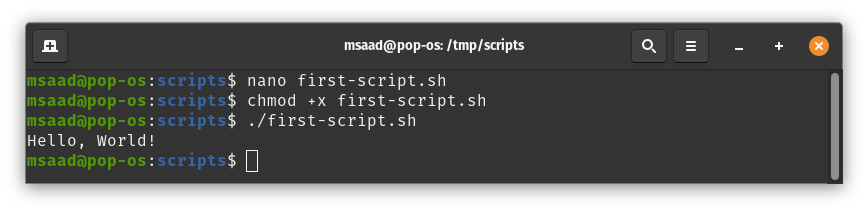

# Session 5

# Shell Scripting

## What are Shell Scripts?
Shell scripts are plain text files that contains a series of commands that will be excuted when the user runs the script. 
An important note is that anything you can run normally on the command line can be put into a script and it will do exactly the same thing and vice versa.

It is convention to give a script the **(.sh)** extension. This is not a must since Linux is a extensionless system. You can give it whatever extension
you want and it will still work as a shell script.

## First shell script!

As mention above, shell scripts are plain text files. Let's use our knowledge with CLI editors to create a new file and write to it. In this case, I will
use `nano`:

`$ nano first-script.sh`


After saving this file, we now have our first shell script. To excute it, we first need to make it excutable. To do so, use the `chmod` command:

`$ chmod +x first-script.sh`

Now our script is excutable. To run it, prepend its name with `./` and press enter:

`$ ./first-script.sh`



### Let's break the everythin down

#### The script

```bash
#!/bin/bash

echo "Hello, World!"
```

* `#!/bin/bash`: The **shebang**
    - Shebang (#!): This is the first line any script. Following it is the path to the interpreter that should be used to run (or interpret) the rest of the lines in the text file. In our case, it's the path to Bash `/bin/bash`. You can check the path to Bash by viewing the content of `/etc/shells` on your
    machine.

* `echo "Hello, World!"`: Bash command that will print a message to the screen. You can type this command yourself on a shell prompt and it will execute
as expected.

#### Why adding ./

This helps bash knowing you are excuting this exact script that is found in the current working directory. On the other hand, when you run a command like `ls`, you don't add `./` because Bash knows where to find it. You can replace `./` with the full path of the script, `/tmp/scripts/first-script.sh` in my case. You also can do the same thing with system commands like `/usr/bin/ls`


