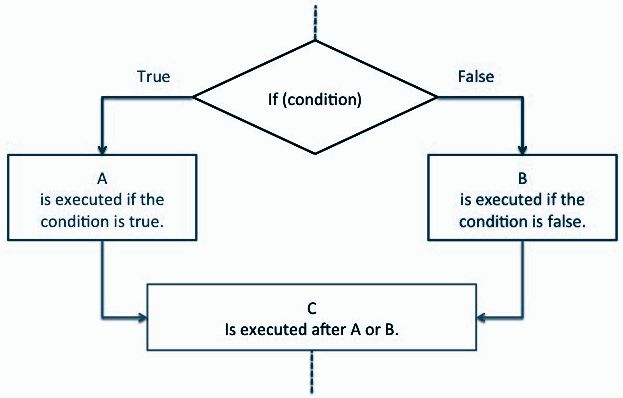

# Session 5


# Shell "Bash" Scripting in GNU/Linux
## What's a shell?
The simplest and most direct way for the user to use their machine.

BASH = Bourne Again SHell


## What is a shell script and why use one?
#### - Running a series of shell commands to:
* **Process Files**
  * Reading Files.
  * Checking if files exist
  * Checking if files have changed.
* **Automate Tasks**
  * Automating the backing up of data
  * Automating package installations
  * Automating updates
* **Using Linux Commands inside a program**
  * Use Linux commands inside programs 
  * Controlling the workflow of your system and commands.

## Command Line Format
Options modify the command's behaviour on the arguments.
##### EXAMPLES:
`[COMMAND]` | `[OPTIONS]` | `[ARGUMENTS]`
---------- | ----------- | ------------
`ls` | `-ld, -la, -lA` | file or directory
`rm` | `-r, -f, -ir` | file or directory
`binwalk` | `-B` | file

You can find what a command's options are and what it does by running:

1. `man command`

2. `info command`

3. `command --help`

# *CAUTION!*
- Never run a Linux command unless you know what it does.
- Take care if a command has a -f command as an option, it could mean **by force**.
- Never run any of the following commands unless you know what you're doing:
 - `rm -rf /` or `rm -rf /*` -> Deletes everything on your system, including Windows and Linux files.
 - `:(){:|:&};:` (aka Fork Bomb) -> Keeps executing a function that calls itself until the system crashes.
 - `command > /dev/sda` -> Data loss on the specified block.
 - `mkfs.ext3 /dev/sda` -> Formats the specified block to ext3, don't do so unless intended.


## Basic Useful Utilities
* **`cat`** Reads the content of a file. __*Example*__:`cat file.txt`
* **`grep`** Searches for a string or pattern inside a file. __*Example:*__ `grep "flag" file.txt`
* **`head/tail`** Display the first/last 10 lines of a file. __*Example:*__ `head file.txt / tail file.txt`
* **`tr`** Replaces occurrences of a character with another. __*Example:*__ `cat file.txt | tr 'a' 'b'`

### IO redirection
* **`|`** Pipes the output of one command to the input of another. __*Example:*__  `cat file.txt | grep 'a'`
* **`>`** Redirects the output of a command to a file. __*Example:*__ `grep "error" log.txt > err.txt`
* **`>>`** Apprends the output of a command to a file. __*Example:*__ `grep "error" log2.txt >> err.txt`


#### **Let's Solve!**
* **Tr: [#1](https://www.hackerrank.com/challenges/text-processing-tr-1/problem) [#2](https://www.hackerrank.com/challenges/text-processing-tr-2/problem)**
* **Head: [#1](https://www.hackerrank.com/challenges/text-processing-head-1/problem) [#2](https://www.hackerrank.com/challenges/text-processing-head-2/problem)**
* **Tail: [#1](https://www.hackerrank.com/challenges/text-processing-tail-1/problem) [#2](https://www.hackerrank.com/challenges/text-processing-tail-2/problem)**
* **Grep: [#1](https://www.hackerrank.com/challenges/text-processing-in-linux-the-grep-command-1/problem) [#2](https://www.hackerrank.com/challenges/text-processing-in-linux-the-grep-command-2/problem)[#3](https://www.hackerrank.com/challenges/text-processing-in-linux-the-grep-command-3/problem)**

### **How to begin writing a shell script?**
1. Create the file. `touch scriptname.sh`
2. Give execute permissions. `chmod +x scriptname.sh`
3. Run the script. `./scriptname.sh`
4. Pass args if needed. `./scriptname arg1 arg2`

* Scripts are a series of commands running after each other.
* The shell reads the script line by line and executes the commands immediately.
  * Don't put 2 commands in the same line, if you do so then make sure to put a semicolon between them. Example: `read x; echo $x`
* You can start running any text editor and creating a text file (any extension works but let's make it .sh to make things clean).
* Usually, when files are made they don't have execution permissions. Give your file the permission by running the following command: `chmod +x SCRIPTNAME.sh`
* After you've written the script, you can run it by running: `./SCRIPTNAME.sh`
* To pass arguments to the script: `./SCRIPTNAME.sh argument1 argument2`

## **Input and Output in Bash**
### Input
* Input is referred to as STDIN.
* You can pass arguments to a bash script as input.
* To prompt input to the user, you use the command: `read` which is roughly equivalent to `scanf()` in C or `input()` in Python.
### Output
* Output is referred to as STDOUT.
* To print output to the user, you use the command: `echo` which is roughly equivalent to `printf()` in C or `print()` in Python.

## **Variables in Bash**
* Variables in bash hold values, which could be a number, a character, or a string of characters.
* Variables names are case-sensitive and can't start with a number, but can start with an underscore.
* To assign a value to a variable:
  * `varname="text with spaces"`
  * `varname='text with spaces without any processing'`
  * `varname=textwithoutspaces`
  * `varname=20`
* BASH does NOT support floating point integers natively.
* You can also use \ as an escape character to prevent certain characters from being processed by the shell such as the space character:
  * `x=text with spaces` -> syntax error
  * `x=text\ with\ spaces` -> value of x = "text with spaces"
* `varname` -> refers to the variable.
* `$varname` -> refers to the value of the variable.

#### **The Difference between ' ' and " " **

* " " -> Interprets what's inside it, including any expressions, variables, etc..
* ' ' -> Interprets what's inside it literally, without calculating or expanding expressions.

**EXAMPLE**
`x=2`

`echo "$x"`  output->  **2**

`echo $x ` output-> **2**

`echo x`  output -> **x**

`echo 'x'` output-> **x**

`echo '$x'` output-> **$x**

# **Using Passed Arguments**
* You can pass arguments to the script by running: `./SCRIPTNAME.sh argument1 argument2`

**To use these arguments as variables, you can access their values by using $X where is the order of the argument.**

_EXAMPLE:_ `./script1.sh 452 SHELL_SCRIPTING`

# **Environment Variables**
* Global system variables accessible by all the processes running under the operating system.
* Environment variables are useful to store system-wide values such as the directories to search for the executable programs (PATH).

**Variables include:**
* `BASH_VERSION` Bash version.
* `HOST_NAME` Host name.
* `HOME` Home directory.
* `PATH` Executable locations.
* `TERM` Default terminal.
* `SHELL` Default shell.
* `EDITOR` Default text editor.

**`printenv` will show you all of the environment variables on your system.**
**`echo $VAR_NAME` prints the value of the specified variable**
# **Arithmetic in Bash**
* **You can do 6 basic arithmetic operators in Bash:**
  * `a + b` addition (a plus b)
  * `a - b` subtracting (a minus b)
  * `a * b` multiplication (a times b)
  * `a / b` integer division (a divided by b)
  * `a % b` modulo (the integer remainder of a divided by b)
  * `a ** b` exponentiation (a to the power of b)
* **Arithmetics can be done using the expression: $((expression))**
  * Example: `a=$((5 - 3 + $b))`
  * Which means: variable `a` is equal `=` to the value of `$()` the expression `(5 - 3 + $b)`


# **Let's Solve!**
* **[The World of numbers:](https://www.hackerrank.com/challenges/bash-tutorials---the-world-of-numbers/problem)**
   * Given two integers, X and Y , find their sum, difference, product, and quotient.
* **Extra:**
  * Write a Bash script that takes 3 integers as arguments and computes their average, prints it, and then prints the average to the power of 2.
  * (After finishing conditionals)
Write a Bash script that reads an equation in the form of "A op B" where op can be any bash operator and outputs the result.


# Conditionals in BASH
If conditions are used to control a program's flow, as in they control what a program does and when.


- Conditionals in C 
```C
if (x == 5)
{
    //DoSomething
}
```
```C
if (x == "String")
{
    printf("1");
}
else if (x == "String 2")
{
    printf("2");
}
else
{
   printf("3");
}
```
- Conditionals in BASH
```sh
if [[ $x -eq 5 ]]
then
    #DoSomething
fi
```
> “{“ ‘opening brace’ is roughly equivalent to `then` and “}” ‘closing brace’ is roughly equivalent to `fi`

```sh
if [[ $x = "String" ]]
then 
    echo 1
elif [[ $x = "String 2" ]]
then
    echo 2
else
    echo 3
fi
```

### Writing conditionals in BASH

- Start a condition with `if [[ condition ]]`
- The next line contains `then` which is roughly equivalent to `‘{‘`
- Write the commands that will execute if the condition is true.
- End your condition with `fi` which is roughly equivalent to `‘}’`
    - Or start an `elif [[ condition ]]`, with `then` in the line after it.
        - Write the commands that will execute if the `elif` condition is true.
        - End your conditionals with `fi`
    - Or start an `else`, with **NO**  `then` in the line after it.
        - Write the commands that will execute if the `else` condition is true.
        - End your conditionals with `fi`

### Conditions

#### Comparing Numerical Variables

Expression in C | Expression in BASH | Evaluates to true when:
:----------: | :-----------: | :------------:
`a == b` | `$a -eq $b` | a is equal to b
`a != b` | `$a -ne $b` | a is not equal to b
`a < b` | `$a -lt $b` | a is less than b
`a > b` | `$a -gt $b` | a is greater than b
`a >= b` | `$a -ge $b` | a is greater than or equal to b
`a <= b` | `$a -le $b` | a is less than or equal to b

**Another way of comparing numberical values is to use ```((  ))``` instead of ```[[  ]]``` which allows you to use C-like operators.**
- Example:
`if [[ $a -eq $b ]]` becomes `if (( a == b ))`

#### Comparing String Variables

Expression in C | Expression in BASH | Evaluates to true when:
:----------: | :-----------: | :------------:
`a == b` | `$a = $b` or `$a == $b` | a is the same as b
`a != b` | `$a != $b` | a is different from b
`strlen(a) == 0` | `-z $a` | a is empty

#### Combining Conditions

Expression in C | Expression in BASH | Evaluates to true when:
:----------: | :-----------: | :------------:
`(cond. A \|\| cond. B)` | `[[ cond. A \|\| cond. B ]]` | A OR B is true
`(cond. A && cond. B)` | `[[ cond. A && cond. B ]]` | A AND B is true
`(!cond. A)` | `[[ ! cond. A ]]` | A is false

#### Let's Solve!
##### [Getting started with conditionals](https://www.hackerrank.com/challenges/bash-tutorials---getting-started-with-conditionals/problem):
- If the character is 'Y' or 'y' display "YES". If the character is 'N' or 'n'
display "NO". No other character will be provided as input.


##### [More on Conditionals](https://www.hackerrank.com/challenges/bash-tutorials---more-on-conditionals/problem):
- Given three integers (X, Y, and Z) representing the three sides of a
triangle, identify whether the triangle is Scalene, Isosceles, or Equilateral.

##### [Comparing Numbers](https://www.hackerrank.com/challenges/bash-tutorials---comparing-numbers/problem):
- Given two integers, X and Y, identify whether X < Y or X > Y or X = Y.

# Loops in BASH

- Loops are used to repeat a process/commands a certain no. of times.
- There are 3 types of loops in Bash (for, while, and until).
- The following slides cover for and while loops only, as until loops are very similar to while and are not used *that* differently.


### For Loops
For loops are sed to loop in a certain range/array.

- For loop in C 
```C
int x;
scanf("%i", &x);
for (int i = 1; i <=x; i++)
{
    printf("%d\n", i);
}
```

- For loop in BASH
```sh
read x
for i in \`seq 1 $x\`
do
    echo $i
done
```

`seq 1 $x` means “sequence from 1 to the value of x, ‘`$x`’ can be replaced with any other value.
- Ex: `seq 1 12` or `seq 1 $y`

You can type the backtick (\`) char by pressing the key left to the “1” key, or the ذ key if you're an Arabic speaker.

### While Loops 

While loops keep repeating a block of commands until the condition becomes false.

- While loop in C 
```C
int x = 1;

while (x < 11)
{
    printf("%d\n", x);
    x++;
}
```

- While loop in BASH
```sh
x=1
while [[ $x -lt 11 ]]
do
    echo $x
    let x+=1
done
```
## General Loop Syntax

- While Loop 
```sh
while [[ CONDITION ]]
do
   #SOMETHING
done
```

- For Loop
```sh
for VAR in RANGE
do
   #SOMETHING
done
```

### Break and Continue statements

- Break
> When the user enters 0, the code continues to run outside the loop.
```sh
while [[ x -lt 10 ]]
do
    read i
    
    if [[ i -eq 0 ]]
    then 
        break
    fi
    echo $i
done

echo "break sent me here"
```

- Continue
> When the user enters 0, the code skips the lines of code below it and continues to the next iteration.
```sh
while [[ x -lt 10 ]]
do
    read i
    
    if [[ i -eq 0 ]]
    then 
        echo "Skipping the rest of the code!"
        continue
    fi
    echo $i
done
```


#### Let's Solve!
##### [Looping with Numbers](https://www.hackerrank.com/challenges/bash-tutorials---looping-with-numbers/problem):
- Use for loops to display the natural numbers from 1 to 50.


##### [Looping and Skipping](https://www.hackerrank.com/challenges/bash-tutorials---looping-and-skipping/problem):
- Use for loops to display only odd natural numbers from 1 to 99.

##### [Compute the Average](https://www.hackerrank.com/challenges/bash-tutorials---compute-the-average/problem):
- Given integers, compute their average correct to three decimal places.
Try solving it on your own, if you can’t you can search for the “`bc`” [command](https://www.geeksforgeeks.org/bc-command-linux-examples/) which can be used to print floating point variables.

# Functions in BASH

Which do you think is easier and more organised?


You may have guessed that B is more organised and easier to write, which is true as it contains the least amount of repeated code.

You can write functions in Bash to organise your code and you can also pass arguments to functions like you can pass them to scripts.

## General Function Syntax

```sh
function NAME #Function Definition
{
     #DoThings
}

NAME #Function call
```

- Alternatively:
```sh
NAME() #Function Definition
{
     #DoThings
}
NAME #Function call
```

- **Example 1:** This is a function that prints "Hello!" 5 times.
```sh
function hello 
{
    for i in `seq ` 5`
    do
        echo "Hello!"
    done
}

hello
```


#### Passing arguments to a function
To use the arguments as variables, you can access their values by using $X where X is the order of the argument passed to the Fn.

- **Example 2:** This is a function that adds 2 numbers.
```sh
function add
{
    echo $(($1 + $2))
}

add 3 5
```


#### Let's Solve!
##### [Looping with Numbers](https://www.hackerrank.com/challenges/bash-tutorials---looping-with-numbers/problem):
- Use for loops to display the natural numbers from 1 to 50.

##### [ENGLISH_CALC Exercise](https://www.learnshell.org/en/Shell_Functions):
- In this exercise, you will need to write a function called ENGLISH_CALC which can process sentences such as:
    - `‘3 plus 5’ → ‘3 + 5 = 8’`
    - `5 minus 1' → ‘5 - 1 = 4’`
    - `4 times 6' → ‘4 * 6 = 24’`

# The Fork Bomb
# :(){:|:&};:

Explanation of the fork bomb:
- We can reorganise the fork bomb to look like this, which is easier to see.
```sh
:()        # Create a function named ‘ : ’
{          # Start of the function body
    : | :& # Calls itself, once in the foreground and once in the background
}          # End of the function body

:          # Function call
```


# References

- [LearnShell](http://www.learnshell.org/en/)
- [TLDP](http://tldp.org/HOWTO/Bash-Prog-Intro-HOWTO.html)
- [Ryan Tutorials](https://ryanstutorials.net/bash-scripting-tutorial/)
- [DevHints](https://devhints.io/bash)
- [LearnXinYMinutes](https://learnxinyminutes.com/docs/bash/)
- [Bash Hackers](http://wiki.bash-hackers.org/)
- [Useful Linux Commands(Quidsup)](https://www.youtube.com/playlist?list=PLzZ0JczEkZfndVnxf6jbWcC9-erWqGcSd)

